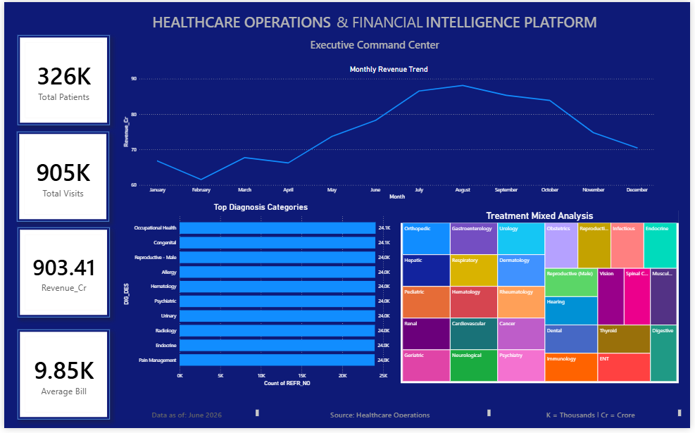

# Healthcare Operations & Financial Analytics Platform

### 📄 Presentation (PDF)
[View Presentation PDF](Healthcare-PDF.pdf)

### 📽️ Presentation (PowerPoint)
[PowerPoint Presentation](Healthcare-PPT.pptx)

## Executive Summary

Healthcare organizations generate large volumes of operational and financial data across patient registration, visits, diagnoses, treatments, and billing systems. This project was developed to transform raw healthcare data into actionable business intelligence using SQL, Python, and Power BI.

The platform provides an executive-level view of patient activity, healthcare operations, diagnosis trends, treatment distribution, and revenue performance to support data-driven decision making.

---

# Business Problem

Healthcare administrators often struggle to answer critical operational and financial questions:

* How many patients are being served?
* What is the total visit volume?
* Which diagnoses are most common?
* Which treatments are frequently performed?
* How much revenue is generated?
* What is the average billing amount?
* How do operational metrics change over time?

This project addresses these challenges through integrated healthcare analytics and executive reporting.

---

# Project Architecture

```text
Excel Files
      │
      ▼
SQL Analysis
      │
      ▼
Python (Pandas)
      │
      ▼
Power BI Dashboard
      │
      ▼
Business Insights
```

---

# Dataset Overview

The project uses six healthcare datasets.

| Dataset        | Description                  |
| -------------- | ---------------------------- |
| STG_EHP_PATN   | Patient Master Data          |
| STG_EHP_VIST   | Visit Information            |
| STG_EHP_DIAG_1 | Diagnosis Records            |
| STG_EHP_DIAG_2 | Additional Diagnosis Records |
| STG_EHP_TRTM   | Treatment Records            |
| STG_EHP_BILL   | Billing & Revenue Data       |

---

# Data Model

## Entity Relationships

```text
PATN
│
├── PAT_ID (Primary Key)
│
▼
VIST
│
├── PAT_ID (Foreign Key)
├── REFR_NO
│
▼
DIAG
│
├── REFR_NO
│
▼
TRTM
│
├── REFR_NO
│
▼
BILL
```

### Business Meaning

* One Patient → Many Visits
* One Visit → Multiple Diagnoses
* One Visit → Multiple Treatments
* One Visit → Multiple Billing Transactions

---

# Data Quality Assessment

## Key Findings

### Patient Dataset

* Missing values identified in middle name fields.
* Date of Birth contained multiple formats.
* Several invalid date values were identified.
* Future date validation required.

### Visit Dataset

* Patient-to-Visit relationship successfully validated.
* Visit records linked using REFR_NO.

### Diagnosis Dataset

* Multiple diagnoses found for several visits.
* Diagnosis categories broadly distributed.

### Treatment Dataset

* Treatment categories successfully mapped.
* Treatment statuses identified and analyzed.

### Billing Dataset

* Revenue calculations validated.
* Billing metrics prepared for dashboard reporting.

---

# Python Analytics

Python (Pandas) was used for data profiling, cleansing, transformation, and exploratory analysis.

## Pandas Functions Used

### Data Exploration

* info()
* describe()
* unique()
* nunique()
* value_counts()

### Aggregation & Analysis

* groupby()
* mean()
* sum()
* min()
* max()
* agg()
* count()

### Data Cleaning

* isnull()
* fillna()
* dropna()
* duplicated()
* drop_duplicates()

### Data Transformation

* merge()
* pivot_table()
* rename()
* map()
* apply()
* lambda()

### Date Analysis

* to_datetime()
* dt.year
* dt.month
* dt.day
* dt.day_name()

### Ranking & Sorting

* sort_values()
* nlargest()
* nsmallest()

---

# SQL Analytics

SQL was used to perform healthcare operational and financial analysis.

## SQL Concepts Demonstrated

### Aggregations

* COUNT()
* SUM()
* AVG()

### Filtering & Grouping

* GROUP BY
* HAVING

### Joins

* INNER JOIN

### Subqueries

* Nested Revenue Analysis
* Above Average Billing Analysis

### Common Table Expressions (CTEs)

* Revenue Analysis by Patient

### Window Functions

* RANK()
* DENSE_RANK()
* ROW_NUMBER()
* LAG()
* LEAD()
* Running Totals

---

# Key Business Metrics

| KPI            | Value      |
| -------------- | ---------- |
| Total Patients | 326K       |
| Total Visits   | 905K       |
| Revenue        | ₹903.41 Cr |
| Average Bill   | ₹9.85K     |

---

# Dashboard Features

## Executive KPI Monitoring

* Total Patients
* Total Visits
* Revenue
* Average Bill

## Revenue Analytics

* Monthly Revenue Trend

## Diagnosis Analytics

* Top Diagnosis Categories

## Treatment Analytics

* Treatment Mix Analysis (Treemap)

---

# Dashboard Preview



---

# Business Insights

## Patient Utilization

* Total patient population exceeded 326K.
* Healthcare utilization exceeded 905K visits.

## Diagnosis Analysis

* Multiple diagnosis categories were identified.
* High-volume diagnosis groups were analyzed.

## Treatment Analysis

* Treatment distribution visualized using Treemap analysis.
* Treatment categories were broadly distributed.

## Revenue Analytics

* Revenue trend monitored across monthly periods.
* Financial performance tracked using billing data.

---

# Technology Stack

* Excel
* SQL
* Python
* Pandas
* Power BI
* DAX
* Power Query

---

# Skills Demonstrated

* Data Cleaning
* Data Validation
* Data Modeling
* SQL Analytics
* Window Functions
* Python Analytics
* Exploratory Data Analysis
* Business Intelligence
* Dashboard Development
* Data Storytelling
* Healthcare Analytics
* Financial Analytics

---

# Future Enhancements

* Doctor Performance Analytics
* Department-Level Reporting
* Patient Retention Analysis
* Predictive Healthcare Analytics
* Revenue Forecasting

---

# Author

Healthcare Operations & Financial Analytics Platform

Developed using SQL, Python (Pandas), and Power BI.
